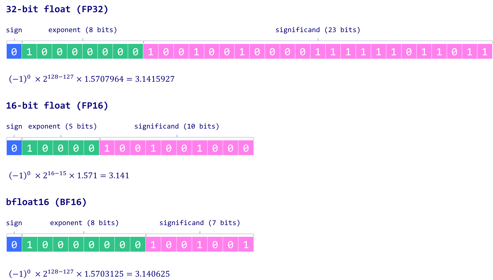

# Quantization

## Maxime Labonne: Introduction to Weight Quantization

Article Source: https://mlabonne.github.io/blog/posts/Introduction_to_Weight_Quantization.html#background-on-floating-point-representation

Code Source: https://github.com/mlabonne/llm-course/blob/main/Introduction_to_Weight_Quantization.ipynb

### Quantization types

We distinguish two main families of weight quantization techniques in the literature:

- **Post-Training Quantization (PTQ)** is a straightforward technique where the weights of an already trained model are converted to lower precision without necessitating any retraining. Although easy to implement, PTQ is associated with potential performance degradation.
- **Quantization-Aware Training (QAT)** incorporates the weight conversion process during the pre-training or fine-tuning stage, resulting in enhanced model performance. However, QAT is computationally expensive and demands representative training data.


### Background on Floating Point Representation

Typically, a floating point number uses `n` bits to store a numerical value. These bits are further partitioned into three distinct components:

- **Sign** [1bit]: The sign bit indicates the positive or negative nature of the number. It uses one bit where 0 indicates a positive number and 1 signals a negative number.

- **Exponent** [2bit]: The exponent is a segment of bits that represents the power to which the base (usually 2 in binary representation) is raised. The exponent can also be positive or negative, allowing the number to represent very large or very small values.

- **Significand/Mantissa**: The remaining bits are used to store the significand, also referred to as the mantissa. This represents the significant digits of the number. The precision of the number heavily depends on the length of the significand.

$$x = (-1)^{\text{sign}} \times 2^{\text{exponent}} \times \text{mantissa}$$

To understand this better, let’s delve into some of the most commonly used data types in deep learning: float32 (FP32), float16 (FP16), and bfloat16 (BF16):

- **FP32**: FP32 uses 32 bits to represent a number: one bit for the sign, eight for the exponent, and the remaining 23 for the significand. While it provides a high degree of precision, the downside of FP32 is its high computational and memory footprint.

- **FP16**: FP16 uses 16 bits to store a number: one is used for the sign, five for the exponent, and ten for the significand. Although this makes it more memory-efficient and accelerates computations, the **reduced range** and precision can introduce numerical instability, potentially impacting model accuracy.

- **BF16**: BF16 is also a 16-bit format but with one bit for the sign, **eight for the exponent**, and seven for the significand. BF16 expands the representable range compared to FP16, thus **decreasing underflow and overflow risks**. Despite a **reduction in precision** due to fewer significand bits, BF16 typically does not significantly impact model performance and is a useful compromise for deep learning tasks.



In ML jargon, FP32 is often termed **full precision (4 bytes)**, while BF16 and FP16 are **half-precision” (2 bytes)**. 

## Naïve 8-bit Quantization

But could we do even better and store weights using a single byte? The answer is the INT8 data type, which consists of an 8-bit representation capable of storing $$2^8 = 256$$

There are two types:
- Absolute Maximum (Absmax) quantization: symmetric approach
- Zero-Point Quantization: asymmetric

### a) Absmax Quantization

With absmax quantization, the original number is divided by the absolute maximum value of the tensor and multiplied by a scaling factor (127) to map inputs into the range [-127, 127]. 

$$X_{\text{quant}} = \text{round}\left(\frac{X}{\text{absmax}(X)} \times 127\right)$$

$$X_{\text{dequant}} = \frac{X_{\text{quant}}}{127} \times \text{absmax}(X)$$

### b) Zero-Point Quantization

We can consider asymmetric input distributions, which is useful when you consider the output of a ReLU function (only positive values) for example.

The input values are first scaled by the total range of values (255) divided by the difference between the maximum and minimum values.

This distribution is then shifted by the zero-point to map it into the range [-128, 127] 

First, we calculate the scale factor and the zero-point value:

$$\text{scale} = \frac{255}{\max(X) - \min(X)}$$

$$ \text{zeropoint} = -\text{round}(\text{scale} \cdot \min(X)) - 128$$

We can quantize weights as follows:
$$ X_{\text{quant}} = \text{round}(\text{scale} \cdot X + \text{zeropoint}) $$

$$ X_{\text{dequant}} = \frac{X_{\text{quant}} - \text{zeropoint}}{\text{scale}} $$


## bitsandbytes

Instead of relying on complete toy examples, we can use these two functions on a real model thanks to the transformers library.
See notebook 02. 

## LLM.int8()

The **LLM.int8() solution** is a method designed to use **INT8 precision** in large language models (LLMs) for inference. This approach enables models to achieve lower memory usage and faster computations while maintaining high accuracy. The key insight is that **low-precision quantization** is selectively applied, ensuring critical information is preserved for operations where accuracy is most sensitive.

Let’s break this down theoretically, mathematically, and with code.

---

## 1. **Theory Behind LLM.int8()**

### Key Concepts
1. **Quantization**:
   - Represent weights and activations with 8-bit integers instead of 16- or 32-bit floating-point numbers.
   - Reduces memory usage by 4x (compared to FP32).
   - Arithmetic is faster due to smaller data types.

2. **Challenge in Full INT8 Quantization**:
   - Some weights/activations in LLMs have wide dynamic ranges or small variations.
   - INT8 quantization may lead to large numerical errors, especially in high-sensitivity operations (e.g., matrix multiplications in attention).

3. **LLM.int8() Solution**:
   - Combines **mixed-precision quantization**:
     - Most weights are in INT8.
     - A small subset of sensitive weights/activations remain in FP16/FP32 to ensure accuracy.
   - Applies **row-wise quantization**:
     - Each row of a weight matrix has its own scaling factor to better adapt to its distribution.

---

## 2. **Mathematical Breakdown**

### a) Row-Wise Quantization
Quantization maps weights $ w $ in a row $ R $ to a smaller range (e.g., INT8: $[-127, 127]$) using a **scaling factor** $ S_R $:

$$
q_R = \text{round}\left(\frac{w_R}{S_R}\right)
$$

Where:
- $ w_R $ is the original FP32 weight row.
- $ S_R = \max(|w_R|) / 127 $: scale ensures all values fit within $[-127, 127]$.

The dequantization is:

$$
w_R' = q_R \cdot S_R
$$

### b) Mixed-Precision Storage
- Most weights $ w_R $ are stored in INT8 ($ q_R $ and $ S_R $).
- Rows with higher variability use FP16 or FP32.

---

## 3. **Code Implementation in PyTorch**

Below is a PyTorch implementation that simulates LLM.int8() quantization for a dummy weight matrix:

### Step 1: Simulate Quantization with Row-Wise Scaling

```python
import torch

def llm_int8_quantization(weights):
    """Simulate LLM.int8() quantization with row-wise scaling."""
    # Initialize lists to store quantized weights and scales
    quantized_weights = []
    scales = []

    # Apply row-wise quantization
    for row in weights:
        scale = row.abs().max() / 127  # Row-wise scale
        scales.append(scale)
        quantized_row = (row / scale).round().clamp(-127, 127).to(torch.int8)
        quantized_weights.append(quantized_row)

    # Stack rows back into a tensor
    quantized_weights = torch.stack(quantized_weights)
    scales = torch.tensor(scales, dtype=torch.float32)
    
    return quantized_weights, scales

# Dummy weight matrix
weights = torch.randn(4, 8) * 10  # Random matrix with higher range values
quantized_weights, scales = llm_int8_quantization(weights)

print("Original Weights:\n", weights)
print("Quantized Weights (INT8):\n", quantized_weights)
print("Scales:\n", scales)
```

### Step 2: Dequantization During Inference

```python
def llm_int8_dequantization(quantized_weights, scales):
    """Simulate dequantization."""
    dequantized_weights = []
    for i, row in enumerate(quantized_weights):
        dequantized_row = row.float() * scales[i]
        dequantized_weights.append(dequantized_row)

    return torch.stack(dequantized_weights)

# Dequantize the quantized weights
dequantized_weights = llm_int8_dequantization(quantized_weights, scales)

print("Dequantized Weights:\n", dequantized_weights)
print("Reconstruction Error:\n", weights - dequantized_weights)
```

---

### 4. **Inference with Mixed-Precision**

When running inference with LLM.int8():
1. **Critical rows** in the weight matrix are left in FP16 or FP32.
2. Operations with less sensitivity use the quantized $ q_R $ and $ S_R $.

Below is a dummy simulation of mixed-precision handling:

```python
def mixed_precision_inference(weights, quantized_weights, scales, use_quantized=True):
    """Simulate matrix multiplication with mixed precision."""
    x = torch.randn(8, 1)  # Input vector for matrix multiplication

    # Use quantized or original weights based on `use_quantized`
    if use_quantized:
        dequantized_weights = llm_int8_dequantization(quantized_weights, scales)
        output = dequantized_weights @ x
    else:
        output = weights @ x

    return output

# Run mixed-precision inference
output_quantized = mixed_precision_inference(weights, quantized_weights, scales, use_quantized=True)
output_fp32 = mixed_precision_inference(weights, quantized_weights, scales, use_quantized=False)

print("Output with Quantized Weights:\n", output_quantized)
print("Output with FP32 Weights:\n", output_fp32)
print("Difference:\n", output_fp32 - output_quantized)
```

---

## 4. **Key Takeaways**
- **Row-Wise Quantization**: Scales each row independently to minimize quantization error.
- **Mixed-Precision**: Retains high precision for critical computations.
- **Efficiency**: Reduces memory and accelerates inference while balancing accuracy.
- **Scalability**: Well-suited for large models like GPT-3 or similar architectures.

This technique is a cornerstone for deploying LLMs efficiently on hardware with INT8 support, such as NVIDIA Tensor Cores.

# Quantization In Detail

Below is an end-to-end introductory guide on the post-training quantization pipeline, focusing on practical steps (Python modules, frameworks), the mechanics of inference with quantized weights (particularly on GPUs), and how mixed-precision matrix multiplication is handled under the hood.

---

## 1. Post-Training Quantization (PTQ) Pipeline Overview

Quantization in the context of deep learning means converting weights (and sometimes activations) from higher precision (e.g., FP32) down to lower precision (e.g., INT8). This is typically performed **after** a model has been fully trained in floating point. The process is thus called **post-training quantization** (PTQ).

Below is a high-level pipeline of a typical PTQ workflow:

1. **Load a Pretrained Model**  
   - You have a Hugging Face Transformers model or a custom PyTorch model.
   
2. **Collect Calibration Data**  
   - Provide a small, representative dataset to “calibrate” (i.e., observe the range/statistics of the weights and activations).
   
3. **Choose Quantization Approach**  
   - Decide whether you want to quantize only the weights or both weights and activations (and whether you want symmetric or asymmetric quantization).
   
4. **Quantize the Model**  
   - Use available tooling (PyTorch, Hugging Face Optimum, bitsandbytes, GPTQ, etc.) to convert model weights from FP32 to, e.g., INT8.
   
5. **Validate/Measure Accuracy**  
   - Evaluate your quantized model’s accuracy on a validation or test set.  
   - Optionally iterate (e.g., re-check calibration, re-quantize certain layers, or revert sensitive layers to FP16).
   
6. **Deploy**  
   - Use the quantized model in inference environments that support INT8 operations.

---

## 2. Python Modules and Frameworks for Quantization

There are multiple approaches and libraries you can use to quantize large language models (LLMs) or any neural network in PyTorch. Below are some commonly used ones:

### 2.1 PyTorch Native Quantization

- **`torch.quantization` / `torch.ao.quantization`**:  
  - PyTorch has native tools for Post-Training Quantization and Quantization-Aware Training (QAT).  
  - Originally in `torch.quantization`, newer releases have moved it to `torch.ao.quantization`.  
  - This pipeline typically focuses on quantizing both weights and activations to INT8.
  - Works well for smaller architectures (e.g., CNNs, RNNs). For large Transformer-based LLMs, you may need specialized solutions due to memory constraints and advanced layering.

### 2.2 Hugging Face Optimum (Intel / OpenVINO / ONNX Runtime)

- **[Optimum Intel](https://github.com/huggingface/optimum-intel)** or **[Optimum ONNX Runtime](https://github.com/huggingface/optimum-onnxruntime)**:  
  - Provide out-of-the-box pipelines for post-training INT8 quantization of Hugging Face Transformer models.  
  - Usually rely on either Intel’s [Neural Compressor](https://github.com/intel/neural-compressor) or ONNX Runtime’s quantization APIs under the hood.  
  - They can automatically handle calibration and creation of a quantized model that can be deployed on CPU (and sometimes GPU if the backend supports INT8 kernels).

### 2.3 BitsandBytes

- **[bitsandbytes](https://github.com/TimDettmers/bitsandbytes)**:  
  - Focuses on 8-bit and 4-bit matrix multiplication kernels.  
  - Has become popular for efficient fine-tuning (especially 4-bit QLoRA approaches).  
  - Allows you to load model weights in 8-bit or 4-bit for memory savings. Under the hood, it uses specialized CUDA kernels to handle low-precision arithmetic.  
  - Great for large LLMs that you want to run on limited GPU memory.

### 2.4 GPTQ

- **[GPTQ-for-LLaMa](https://github.com/qwopqwop200/GPTQ-for-LLaMa)** (and variations):  
  - GPTQ stands for **“Quantization through Partial Use of Quadratic Programming”**, a method specifically designed for post-training quantization of LLMs with minimal accuracy loss.  
  - Often used in the open-source community to quantize LLaMA or GPT-like weights to 4-bit or 8-bit.  
  - The library automates the quantization of each layer while attempting to preserve overall model performance.

### 2.5 Nvidia TensorRT

- **[TensorRT](https://developer.nvidia.com/tensorrt)**:  
  - A highly optimized inference engine for Nvidia GPUs.  
  - Allows you to import a trained model (e.g., via ONNX) and run INT8 calibration.  
  - Typically used to accelerate inference in production, supporting fused INT8 kernels.  
  - Requires an ONNX export from PyTorch or other frameworks, then uses TensorRT for the actual INT8 inference deployment.

---

## 3. How Quantized Inference Runs on GPU

Once the model weights are quantized to 8-bit integers, the GPU needs to perform matrix multiplications and other operations in low-precision. Here are the typical steps:

1. **Store Quantized Weights in GPU Memory**  
   - Weights are kept in INT8 format, so you only need 1 byte per weight. This significantly reduces memory footprint compared to FP32.  
   - When the GPU sees that an operation will use INT8 weights, it dispatches specialized kernels (e.g., Tensor Cores for INT8 if available).

2. **Dequantize Activations On-The-Fly (If Needed)**  
   - Depending on the library, activations may be quantized as well (INT8) or kept in higher precision (FP16/FP32).  
   - If the activation is in FP16/FP32 but your weights are INT8, the GPU may do an internal conversion to a common format for the multiply-accumulate.  
   - Typically, many INT8 kernels are implemented so that the **multiplication** happens in INT8 and the **accumulation** (the partial sums) happen in higher precision (e.g., INT32 or FP16) to preserve accuracy.

3. **Perform Matrix Multiplication**  
   - The GPU’s specialized INT8 kernels handle the dot products using 8-bit integer multiplication.  
   - Accumulation is often done in 32-bit integer or 16-bit floating point.  
   - If necessary, the result is cast back to the desired activation precision (INT8, FP16, or FP32).

4. **Latency and Performance**  
   - INT8 calculations can be **faster** than FP32 on modern GPUs that have dedicated hardware for INT8 (e.g., Nvidia Tensor Cores).  
   - The main performance gains come from:  
     - Lower memory bandwidth (1 byte vs. 4 bytes per weight).  
     - Potentially higher throughput INT8 kernels.  
   - However, the actual speedup vs. float can vary depending on the GPU architecture and whether you have enough GPU compute to saturate INT8 Tensor Cores. In some cases, overhead from conversions or kernel limitations may reduce theoretical gains.

---

## 4. Mixed-Precision Concerns: Matrix Multiplications and Intermediate Results

### 4.1 Are Intermediate Results Also Quantized?

- **Weights**: Often quantized to INT8.  
- **Activations**: Can be quantized or not, depending on the approach.  
  - **Weight-Only Quantization**: Keep activations in FP16 or FP32. The weight values are INT8, so during the forward pass, the GPU will cast or interpret them in a kernel that can handle mixed precision (INT8 \* FP16, for example).  
  - **Full (Weight + Activation) Quantization**: Both weights and activations are in INT8, which requires dedicated calibration for activation ranges as well.  
  - In practice, many LLM quantization approaches focus on weight-only quantization to minimize accuracy degradation.

### 4.2 Multiplying FP32 Tensors with INT8 Weights

Yes, it is common for your token embeddings or other input data to be in floating point (FP32 or FP16) while your model’s weights are in INT8. Under the hood:

1. The GPU kernel recognizes that one operand is INT8 and the other is FP32 or FP16.  
2. It **either** internally converts FP32 -> INT8 (for the multiply) **or** uses specialized **INT8 \* FP16** or **INT8 \* FP32** fused operations.  
3. Intermediate accumulations might be done in INT32 or FP16 to avoid overflow or precision loss.  
4. The final output might be in FP16/FP32 for the next layer.

PyTorch’s internal tensor operations handle these conversions automatically as long as you use either the official quantization APIs or specialized libraries (bitsandbytes, TensorRT, etc.) that have custom kernels for mixed-precision operations.

---

## 5. Memory Impact of Quantization

When you quantize weights from FP32 to INT8:

- **FP32**: 4 bytes per parameter  
- **INT8**: 1 byte per parameter  

Hence, you reduce the model size in memory by up to **4x**. This reduction helps:

- **GPU Memory Footprint**: You can fit bigger models in the same VRAM (especially relevant for large LLMs).  
- **Bandwidth**: Less data transfer means potentially faster inference.  

If you also quantize activations from FP32 to INT8, you similarly reduce activation memory usage (especially beneficial if your batch size is large). However, activation quantization may require more careful calibration to avoid significant accuracy loss.

---

## 6. Putting It All Together

1. **Load Pretrained Model**  
   ```python
   from transformers import AutoModelForCausalLM, AutoTokenizer
   
   model_name = "facebook/opt-1.3b"
   model = AutoModelForCausalLM.from_pretrained(model_name)
   tokenizer = AutoTokenizer.from_pretrained(model_name)
   ```
2. **Select a Quantization Toolkit**  
   - **PyTorch**: `torch.quantization` or `torch.ao.quantization`  
   - **Hugging Face Optimum**: `pip install optimum-intel`, or `optimum-onnxruntime`  
   - **bitsandbytes**: `pip install bitsandbytes`  
   - **GPTQ**: For specialized 4-bit/8-bit quantization on LLaMA-like models.

3. **Calibrate** (Optional for weight-only, mandatory for activation quant)  
   - Run inference on a small dataset to gather statistics about the weight/activation ranges.

4. **Quantize**  
   - For example, with bitsandbytes:
     ```python
     import torch
     import bitsandbytes as bnb
     
     quantized_model = bnb.nn.Linear8bitLt(model.config.hidden_size, model.config.hidden_size)
     # This is just an example of how you'd wrap layers in 8bit modules, 
     # in practice you’d convert the entire transformer block.
     ```
   - Or with Hugging Face Optimum Intel:
     ```python
     from optimum.intel.neural_compressor import IncQuantizer

     quantizer = IncQuantizer(model)
     quantized_model = quantizer.fit(…)
     ```
   - Or with PyTorch native APIs, you’d apply a post-training quantization procedure that inserts quantize/dequantize stubs around layers.

5. **Evaluate and Validate**  
   - Generate predictions on a validation set.  
   - Compare perplexity or other metrics before/after quantization.

6. **Deploy**  
   - If using PyTorch, just `model.to('cuda')` (ensuring you have the quantized model loaded).  
   - If using TensorRT, export to ONNX, run `trtexec --int8` with calibration.  
   - If using bitsandbytes, you can do `.forward()` as usual—bitsandbytes handles low-level kernel calls.

---

## 7. Answers to Key Questions

**Q1) Which Python modules are used for Hugging Face or PyTorch model quantization?**  
- **PyTorch** built-ins: `torch.ao.quantization`  
- **Hugging Face Optimum**: `optimum-intel`, `optimum-onnxruntime` for CPU or GPU-based INT8 pipelines  
- **bitsandbytes**: Popular for 8-bit or 4-bit model loading  
- **GPTQ**: Specialized for LLMs  
- **TensorRT**: For Nvidia GPU inference optimization (ONNX-based)

**Q2) How does the LLM perform inference with quantized weights?**  
- Quantized weights (INT8) are stored on GPU memory, significantly reducing footprint.  
- Specialized low-precision kernels handle the matrix multiplications.  
- Latency can decrease due to reduced memory bandwidth usage and specialized tensor cores. However, real-world speedup depends on the GPU architecture and your model’s layer structure.

**Q3) Are intermediate results also quantized, or are they in float precision?**  
- Depends on the quantization scheme.  
- **Weight-Only**: Weights = INT8, Activations = FP16/FP32.  
- **Activation Quantization**: Activations also in INT8.  
- Many LLM-specific quantization methods stick to weight-only to maintain accuracy.

**Q4) Can a float32 tensor multiply with int8 weights? What happens under the hood?**  
- Yes, that is common. The GPU uses a mixed-precision kernel (e.g., INT8 \* FP32 → accumulation in INT32 or FP16).  
- PyTorch or bitsandbytes automatically handle the type casting and dispatch to the correct kernel.  
- You don’t get errors because these frameworks have built-in support for mixed-precision ops.

---

## Conclusion

Quantization offers an attractive route to reduce model size and increase inference speed, especially for large language models where memory is a bottleneck. Modern GPU architectures include dedicated INT8 hardware, enabling up to **4×** memory reduction (and potentially faster inference) compared to FP32.

When you’re implementing post-training quantization in practice:

1. **Pick a suitable library** (PyTorch AO quantization, Hugging Face Optimum, bitsandbytes, GPTQ, TensorRT).  
2. **Decide on weight-only or full quantization** based on accuracy requirements and complexity.  
3. **Use calibration** to find optimal scale and zero-points.  
4. **Validate** carefully to ensure minimal accuracy drop.  
5. **Deploy** on a hardware platform that supports INT8 or 4-bit inference.

By following this workflow and understanding the mechanics behind how the GPU handles quantized operations, you’ll be well-equipped to implement efficient and accurate quantization pipelines for your LLMs.

# Qauntization Formats

When browsing the open-source community—particularly around LLaMA-based or GPT-based models—you may encounter several **quantization “labels”** like `8-bit`, `4-bit`, `q4_0`, `q4_1`, `GPTQ`, etc. Each label attempts to convey how many bits are used to store weights (and sometimes activations) and what algorithm or technique was used to quantize them. Below are the most common terms:

## 1.1 Bit-Width Terminology

1. **FP32** (32-bit floating point): The standard for training. Each weight = 32 bits = 4 bytes.  
2. **FP16** (16-bit floating point): Half-precision float, widely used for model training/inference with less memory usage and faster compute on modern GPUs.  
3. **INT8** (8-bit integer): Commonly used for inference, with a 4× reduction in memory vs. FP32.  
4. **INT4** (4-bit integer): Even more memory-efficient, halving the size of INT8.  

Within the 4-bit realm, there is a growing variety of specialized approaches to best preserve accuracy despite drastically reduced precision.

## 1.2 Common 4-Bit Quantization Schemes

### 1.2.1 Q4_0, Q4_1, Q5_0, Q5_1, etc.

These notations often appear in the context of **GPTQ**-based or **GGML**-based quantization for LLaMA or other GPT-like models. They encode a specific arrangement of how quantization scales and zero points are computed within small blocks (e.g., block-wise quantization).

- **Q4_0**: A simple 4-bit quantization approach with minimal overhead. Each group (block) of parameters uses a single scaling factor but does not store an extra offset.  
- **Q4_1**: Similar to Q4_0, but includes a more sophisticated scaling/offset approach that helps preserve some accuracy. Often each block has both a scale factor and a bias or shift to better fit the distribution.  
- **Q5_0, Q5_1**: Extends the idea of block-wise quantization but allocates 5 bits for precision. This can reduce quantization error compared to 4-bit.

These naming conventions come from the **GGML** library by Georgi Gerganov, widely used in LLaMA CPU inference. Each scheme tries to strike a balance between compression ratio and accuracy retention by tweaking how block-level scales, offsets, or partial floating bits are stored.

### 1.2.2 GPTQ

- **GPTQ** stands for “Quantization through Partial Use of Quadratic Programming.”  
- It is specifically designed for **post-training quantization** of large Transformers.  
- The GPTQ algorithm itself can produce 8-bit or 4-bit quantized weights with minimal accuracy loss, typically using a per-channel or per-row block scheme.  
- Often you see references like “GPTQ 4-bit” or “GPTQ 8-bit” to indicate that the weights were processed through the GPTQ procedure rather than a simpler uniform quantization.

### 1.2.3 Bitsandbytes 4-bit (QLoRA)

- **QLoRA** uses a 4-bit representation for model weights (or low-rank adaptation parameters) during fine-tuning.  
- Internally, bitsandbytes might use a “nf4” (normal float 4) format for each block, which is a special per-channel scale/offset approach that better matches normal distributions.  
- This approach is more about efficient training/fine-tuning but also can be used for inference.

## 1.3 Symmetric vs. Asymmetric, Per-Tensor vs. Per-Channel

Even if two models are both labeled as “8-bit,” the underlying details can differ:

- **Symmetric**: Both positive and negative ranges are mapped equally.  
- **Asymmetric**: Zero-point is shifted to handle skewed distributions.  
- **Per-Tensor**: One scale/zero-point for the entire tensor.  
- **Per-Channel (Per-Row/Column)**: Each row or channel has its own scale/zero-point, improving accuracy but slightly increasing memory overhead to store those additional parameters.

In GPTQ-based or block-wise 4-bit quantization, you’ll often see “per-row” block quantization. This is done for performance reasons in matrix multiplication (since each row is multiplied by a single vector of input activations).

---

# Model Weight File Formats

Once you’ve quantized your model, you need to store the weights on disk. In the broader machine learning ecosystem, you’ll see various file formats that differ in how they represent the parameter data, how they handle metadata, and whether they’re optimized for CPU or GPU. Here are some of the most common:

## 2.1 PyTorch Checkpoints (`.pt` or `.bin`)

- **Standard PyTorch format** using `torch.save()`.  
- The checkpoint is typically a Python pickle containing the model’s state_dict (parameter tensors).  
- For smaller models, it’s convenient. For extremely large LLMs, it can be quite large, and loading can be slower due to Python overhead.

## 2.2 Safetensors (`.safetensors`)

- **Safetensors** is an emerging standard that addresses security and speed issues with pickle-based PyTorch files.  
- It is a **zero-copy** format designed for speed and to avoid arbitrary code execution—unlike Python pickle.  
- Hugging Face supports safetensors for Transformers models.  
- It can store any type of tensor (FP32, INT8, etc.) with metadata in a structured, safe manner.  
- When dealing with large LLMs, safetensors typically provides faster load times and better memory efficiency than `.bin` or `.pt` files.

## 2.3 ONNX

- **Open Neural Network Exchange (ONNX)** is a framework-agnostic format.  
- Often used as an intermediate representation for inference optimizers like TensorRT or ONNX Runtime.  
- Supports FP32, FP16, INT8, and other data types, as long as you define the quantization scheme properly (e.g., via fake quantization nodes or with ONNX quantization operators).  
- ONNX files can be large, but they are highly portable across different runtimes.

## 2.4 GGML (`.ggml`), GGUF (`.gguf`)

- **GGML** is a C/C++ library by Georgi Gerganov tailored for CPU-based inference with quantized models (especially LLaMA).  
- The `.ggml` file format became popular for “GPT4All” and “llama.cpp” to run LLMs on CPU with 4-bit or 8-bit quantization.  
- **GGUF** is a **newer** format that supersedes GGML for LLaMA-based models in llama.cpp. It is more extensible and supports various new features (like multiple architectures, language tokens, etc.).  
- Both `.ggml` and `.gguf` store block-quantized weights in Q4_0, Q4_1, Q5_0, Q8, etc.  
- The library loads these formats directly into CPU memory and runs inference with specialized quantized kernels.

### 2.4.1 Why GGUF?

- **Metadata**: GGUF provides extended metadata fields, easier model introspection, and better multi-architecture support.  
- **Quantization**: It can store multiple quantization schemes (Q4_x, Q5_x, Q8_x, etc.) within the same design.  
- **Future-proof**: Expands easily as new quantization types appear.

## 2.5 TensorRT Engines (`.plan`)

- **NVIDIA TensorRT** uses a proprietary engine format (`.plan`) after you convert or calibrate a model (e.g., from ONNX).  
- This is highly optimized for NVIDIA GPUs and can store INT8 calibration scales internally.

## 2.6 HDF5 / Keras, TF SavedModel, Etc.

- More common outside the PyTorch ecosystem, e.g., in TensorFlow or older Keras approaches.  
- Generally not used for cutting-edge LLM quantization pipelines that revolve around PyTorch/Hugging Face.

---

## 3. Low-Level Details of Quantized File Formats

### 3.1 Safetensors Under the Hood

- **Structure**: Safetensors files contain a header with metadata (tensor name, dtype, shape, offset, etc.) followed by raw binary data for each tensor.  
- **Memory Mapping**: They can be memory-mapped so that only needed segments of the file are loaded into RAM, speeding up partial or lazy loading.  
- **No Arbitrary Code**: The file format is purely data, so it’s safer compared to Python pickle.  
- **Compatibility**: Hugging Face Transformers integrates safetensors seamlessly, e.g. `model.from_pretrained(..., use_safetensors=True)`.

### 3.2 GGML / GGUF File Structures

- **Block-Quantized Tensors**:  
  - Tensors are split into small blocks (e.g., 32 or 64 weights per block).  
  - Each block has a small header with scale(s) and potentially offset(s), followed by the 4-bit or 5-bit data.  
- **Vocabulary & Model Hyperparameters**:  
  - The file includes the token embeddings, final layer norms, and other needed parameters.  
  - GGUF adds more robust metadata than older GGML versions, letting the program detect model versions, dimension sizes, etc.  
- **Load Process**:  
  - The library reads each tensor in small chunks, reconstructs them in memory, then uses CPU kernels to perform forward passes.  
  - The advantage is that the file is already in a quantized, CPU-friendly layout—no additional format conversion needed at run time.

### 3.3 Considering Mixed-Precision Tensors

Some advanced quantization schemes (like GPTQ + partial FP16 for certain layers) might store a mixture of data types in the same checkpoint. For example:

- Attention key, query, value weights in 4-bit.  
- LayerNorm or embedding layers in FP16.  
- A small fraction of sensitive weights in FP16 if they degrade accuracy too much in INT4.

In such scenarios, the file format must support multiple data types (like `.safetensors` or `.gguf` can) and store them consistently.

---

## 4. Practical Considerations

### 4.1 Choosing a Quantization Format

- **If you want maximum portability**: ONNX or safetensors might be a good pick.  
- **If you run on CPU with llama.cpp**: Use `.gguf` quantized weights.  
- **If you want to stay in PyTorch**: Safetensors is a fast, secure, and user-friendly approach.  
- **If you target NVIDIA GPU**: You might do an ONNX export + TensorRT engine or just load a `.pt/.safetensors` PyTorch checkpoint with bitsandbytes or GPTQ kernels.

### 4.2 Performance vs. Ease of Use

- Some specialized formats (like `.gguf`) can yield impressive CPU-based performance for LLaMA models but require specific tools (llama.cpp).  
- On GPUs, frameworks like bitsandbytes or GPTQ will typically read from a safetensors or PyTorch checkpoint, then do the quantized computations at runtime.

### 4.3 Model Conversion Tools

- For LLaMA-based models, you often see scripts that convert **original checkpoints** (e.g., Meta’s `.pth` files) to GGML / GGUF or safetensors, possibly applying GPTQ in the process.  
- Hugging Face transformers:  
  ```bash
  python convert_llama_weights_to_hf.py \
    --input_dir /path/to/llama \
    --model_size 7B \
    --output_dir /path/to/output_hf
  ```
  Then you might run a GPTQ script to produce `.pt` or `.safetensors` with 4-bit quantization, or a `gguf-quantize` tool to produce `.gguf`.
